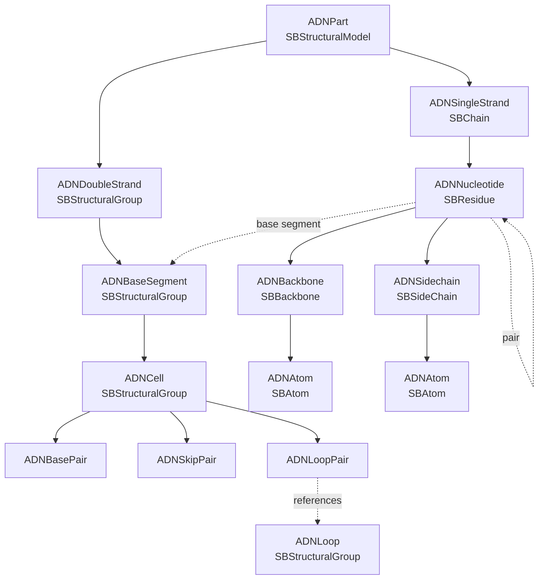

# Adenita Data Graph

Adenita represents DNA nanostructures as SAMSON data graph nodes. The graph combines two views of the same design:

- A double-strand view, organized as `ADNDoubleStrand` nodes containing ordered `ADNBaseSegment` nodes.
- A single-strand view, organized as `ADNSingleStrand` nodes containing ordered `ADNNucleotide` nodes.

Cross-references between these views connect nucleotides to base segments, paired nucleotides, loop cells, and atom-level children.

## Node Hierarchy



The same structure as a compact tree:

```text
ADNPart (SBStructuralModel)
|-- ADNDoubleStrand (SBStructuralGroup)
|   `-- ADNBaseSegment (SBStructuralGroup)
|       `-- ADNCell (ADNBasePair, ADNSkipPair, or ADNLoopPair)
|-- ADNSingleStrand (SBChain)
|   `-- ADNNucleotide (SBResidue)
|       |-- ADNBackbone (SBBackbone)
|       |   `-- ADNAtom (SBAtom)
|       `-- ADNSidechain (SBSideChain)
|           `-- ADNAtom (SBAtom)
`-- referenced ADNLoop nodes for loop-pair cells
```

## Cross-References

- `ADNNucleotide` stores its paired nucleotide and the `ADNBaseSegment` it belongs to.
- `ADNNucleotide::GetPrev` and `ADNNucleotide::GetNext` navigate the containing `ADNSingleStrand`.
- `ADNBaseSegment::GetPrev` and `ADNBaseSegment::GetNext` navigate the containing `ADNDoubleStrand`.
- `ADNBaseSegment` owns an `ADNCell` pointer. The cell type is one of `ADNBasePair`, `ADNSkipPair`, `ADNLoopPair`, or `Undefined`.
- `ADNBasePair` references left and right nucleotides and can pair them.
- `ADNLoopPair` references left and right `ADNLoop` nodes. Each `ADNLoop` stores the nucleotides that form the loop.
- `ADNBackbone` and `ADNSidechain` hold atom children for the nucleotide's coarse or atomistic representation.
- Auxiliary reference nodes may be used for SAMSON-level relationships such as bonds between atoms.

## Registration and Indexing

`ADNPart` is the root structural model for an Adenita component. It exposes registration and deregistration methods for double strands, base segments, single strands, nucleotides, and atoms.

The current implementation keeps a part-level index for base segments. Optional compile-time switches in `ADNPart.hpp` control whether parts also maintain explicit indexes for strands, nucleotides, and atoms. When those indexes are disabled, getters traverse the SAMSON child graph instead.

Mutation code should use the registration and deregistration helpers instead of manually moving graph nodes. This keeps parent-child relationships, indexes, bounding boxes, nucleotide ordering, and cross-references consistent.

## Implementation Pointers

- Core graph classes: `AdenitaCoreSE/include/ADNPart.hpp`, `ADNDoubleStrand.hpp`, `ADNSingleStrand.hpp`, `ADNBaseSegment.hpp`, `ADNCell.hpp`, `ADNNucleotide.hpp`, `ADNLoop.hpp`.
- Registration, deletion, splitting, merging, and strand operations: `AdenitaCoreSE/source/ADNPart.cpp` and `AdenitaCoreSE/source/ADNBasicOperations.cpp`.
- Save/load support: `AdenitaCoreSE/include/ADNSaveAndLoad.hpp` and `AdenitaCoreSE/source/ADNSaveAndLoad.cpp`.
- SAMSON class descriptors and serialization exposure: `AdenitaCoreSE/include/ADNModelDescriptor.hpp` and `ADNPartDescriptor.hpp`.
